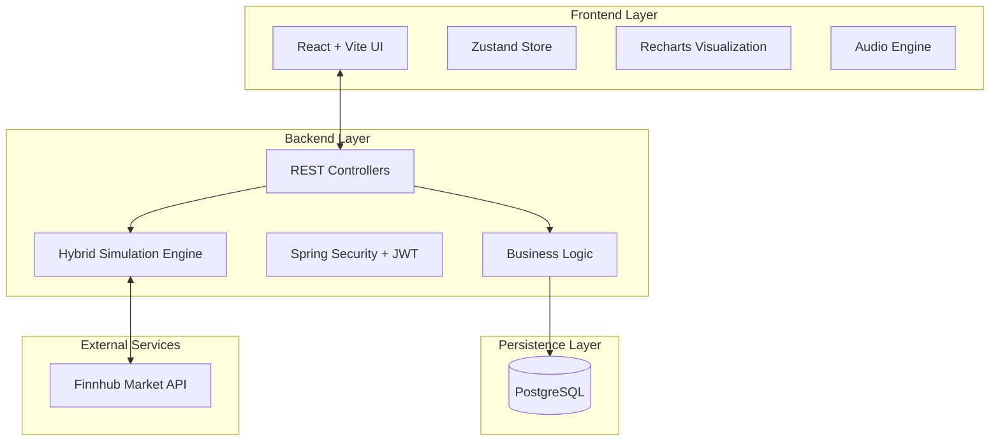

<div align="center">

# ⚡ DeltaTrading

  **The Next-Generation Gamified Trading Platform**

  [](https://react.dev)
  [](https://spring.io/projects/spring-boot)
  [](https://www.postgresql.org/)
  [](LICENSE)

  <p align="center">
    <a href="#-key-features">Key Features</a> •
    <a href="#-architecture">Architecture</a> •
    <a href="#-getting-started">Getting Started</a> •
    <a href="#-gallery">Gallery</a>
  </p>
</div>

---

## 📖 About

**DeltaTrading** redefines the paper trading experience by merging professional-grade financial tools with engaging RPG mechanics. Designed for both beginners and enthusiasts, it provides a strictly risk-free environment to master the stock market while leveling up your virtual portfolio.

> **"Learn. Trade. Level Up."**

---

## 📸 Dashboard Preview

<div align="center">
  
</div>

---

## 🔥 Key Features

### 🖥️ Professional Dashboard

- **Live Market Data**: Real-time integration with Finnhub API for accurate pricing.
- **Hybrid Simulation Engine**: A custom-built engine that generates micro-ticks (every 1s) between API calls for a fluid, professional terminal experience.
- **Interactive Charts**: High-performance area charts powered by Recharts with time-frame toggles (1D, 1W, 1M).

### 🎮 Gamification System

- **XP & Progression**: Earn experience points for profitable trades and smart decisions.
- **Leveling System**: Unlock advanced features and higher tiers as you level up.
- **Achievements**: Collect badges for milestones like "First Million", "Risk Taker", and "Diversified".
- **Leaderboards**: Compete globally weekly rankings.

### � Portfolio Management

- **Virtual Wallet**: Start with **$10,000** in paper money.
- **Realistic Transactions**: Deposit and withdraw funds with auditory feedback.
- **Advanced Order Types**: Execute Market Buys, Sells, and Stop-Loss orders (Coming Soon).
- **P/L Analytics**: Track Realized and Unrealized Profit/Loss in real-time.

---

## 🏗️ Technical Architecture

DeltaTrading is built on a scalable **Client-Server** architecture, ensuring high performance and data integrity.



---

## 🛠️ Tech Stack

| Component | Technology | Description |
|-----------|------------|-------------|
| **Frontend** | React 18, Vite | High-performance UI library |
| **Styling** | TailwindCSS | Utility-first CSS framework for Glassmorphism |
| **Animations** | Framer Motion | Smooth UI transitions and effects |
| **Backend** | Spring Boot 3 | Robust Java framework for enterprise apps |
| **Database** | PostgreSQL | Relational database for transactional integrity |
| **Security** | Spring Security | Auth modeling and protection |
| **Data** | Finnhub API | Real-time stock market data |

---

## 🚀 Getting Started

Follow this comprehensive guide to set up DeltaTrading locally.

### Prerequisites

- [Java JDK 17+](https://www.oracle.com/java/technologies/downloads/)
- [Node.js 18+](https://nodejs.org/)
- [PostgreSQL](https://www.postgresql.org/download/)

### 1. Database Configuration

Open your PostgreSQL terminal or GUI (pgAdmin) and run:

```sql
CREATE DATABASE deltatrading_db;
```

### 2. Backend Initialization

1. Navigate to the project root.
2. (Optional) Update `src/main/resources/application.properties` with your DB credentials.
3. Run the application:

```bash
# Windows
./mvnw spring-boot:run
```

> The server will start on **<http://localhost:8081>**

### 3. Frontend Initialization

1. Open a new terminal window.
2. Navigate to the frontend directory:

```bash
cd frontend
```

1. Install dependencies and start the dev server:

```bash
npm install
npm run dev
```

> The application will launching at **<http://localhost:5173>**

---

## 🖼️ Application Gallery

Explore the various interfaces of DeltaTrading.

| Market Overview | Trading Interface |
|:---:|:---:|
|  |  |
| **User Profile** | **Leaderboard** |
|  |  |
| **Virtual Wallet** | **Trade History** |
|  |  |

---

## � License

This project is licensed under the MIT License - see the LICENSE file for details.

---

<div align="center">
  <sub>Built with ❤️ by Dipanjan</sub>
</div>
